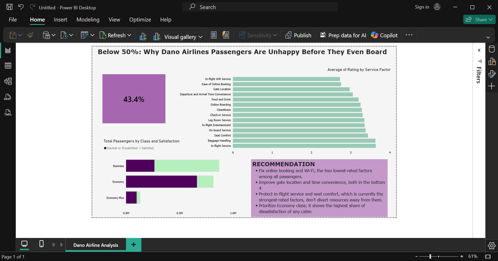

# Dano_Airline_Analysis

Dano Airlines, a UK-based carrier headquartered in London, recorded a passenger satisfaction rate of 43.4% in its latest survey and the first time satisfaction has fallen below 50%. Leadership needs a clear, data-backed direction for where to focus improvement efforts.
This project analyzes survey responses from 129,880 passengers to identify the specific factors driving dissatisfaction and recommend a prioritized action plan.

## Dataset
- Source: Airline passenger satisfaction survey 
- Size: 129,880 records, 24 columns
- Includes: passenger demographics, flight details (distance, delays), travel class, and ratings (0–5 scale) across 14 service touchpoints; including Wi-Fi, online booking, gate location, check-in, seat comfort, cleanliness, and in-flight service.

## Data Cleaning And MOdeling
- Missing values: The Arrival Delay column had 393 missing values (0.3% of records). These were replaced with the column median, which was 0 — reflecting that most flights in the dataset arrive on time or early, so the median is a more representative fill value than the mean, which would be skewed upward by extreme delay outliers.
- Verification: All other columns were confirmed to have zero missing values across all 129,880 rows, so no other imputation was needed.
- Column removal: The ID column was dropped — it carries no analytical value, and COUNTROWS() is used instead for all passenger counts, which avoids any dependency on a specific column being null-free.
- Unpivoting: The 14 individual service rating columns were unpivoted into two columns — Service Factor and Rating — so all factors could be ranked and compared in a single visual rather than building one chart per factor.

##DAX Measure
- Total Passengers = COUNTROWS(AirlineSatisfaction)
- % Satisfied =
- DIVIDE( CALCULATE(COUNTROWS(AirlineSatisfaction), AirlineSatisfaction[Satisfaction] = "Satisfied"),
 COUNTROWS(AirlineSatisfaction) )
- % Dissatisfied = 1 - [% Satisfied]
- % Satisfied is reused across every breakdown (by class, by factor, by segment) rather than writing a separate measure per segment, since DAX automatically recalculates the measure based on the filter context of whatever visual it's placed in.

## Key Insights
- Overall satisfaction sits at 43.4% — a clear majority of passengers (56.6%) report being neutral or dissatisfied.
- The lowest-rated factors are all pre-flight or digital touchpoints, not in-cabin service: In-flight Wi-Fi, Ease of Online Booking, and Gate Location rank as the three weakest areas.
- In-flight service quality is actually a strength — Baggage Handling, In-flight Service, and Seat Comfort rank among the highest-rated factors, showing the cabin experience itself is not the core problem.
- Dissatisfaction is concentrated in Economy class — Economy passengers show a substantially higher share of dissatisfaction than Business class passengers.

## Recommendation
- Fix online booking and Wi-Fi — the two lowest-rated factors among all passengers.
- Improve gate location and time convenience — both fall in the bottom four factors.
- Protect in-flight service and seat comfort — currently the strongest-rated factors; resourcing decisions should not divert investment away from what is already working.
- Prioritize Economy class — it shows the highest share of dissatisfaction of any cabin, so digital and ground-experience fixes should be rolled out there first for the largest impact on overall satisfaction.

  
## Dashboard Page 
Page 1- Dano Airline Analysis which includes:
- A headline KPI card (43.4% Satisfied)
- A ranked bar chart of all 14 service factors by average rating
- A satisfaction breakdown by travel class
- A recommendations panel tying the insights to specific action items

## Dashboard Screenshot

*Capstone* *project* *for* *DigitaleyDive* *Data* *Analyst* *Bootcamp* — *submitted* *by* *Blessing*
